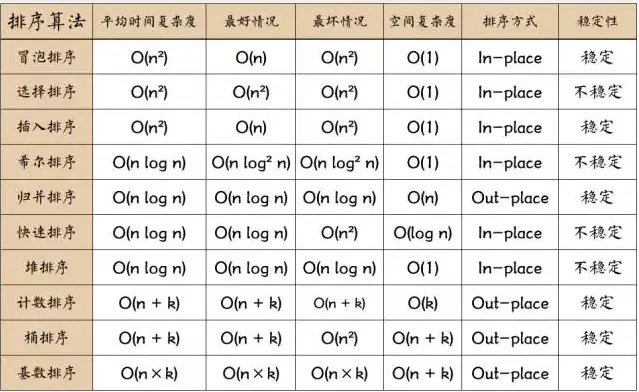

# 图解十大经典排序
  
注：n表示数据规模，k表示桶的个数，In-place表示占用常数内存或不占用额外内存，Out-place表示占用额外内存。什么是稳定性？当排序后2个相等键值的顺序 和 排序前它们的顺序相同，则表示“稳定”。
## 1、冒泡排序


``` java

    /**
     * 冒泡排序
     *
     * @param a
     */
    static public void bubbleSort(int[] a) {
        if (a.length < 2) {
            return;
        }
        for (int i = 0; i < a.length - 1; i++) {
            for (int j = 0; j < a.length - i - 1; j++) {
                if (a[j] > a[j + 1]) {
                    int temp = a[j];
                    a[j] = a[j + 1];
                    a[j + 1] = temp;
                }
            }
        }
    }

    /**
     * 冒泡排序 改进
     * 置一个标志位，记录最后换位置的位置
     *
     * @param a
     */
    static public void bubbleSortPro(int[] a) {
        if (a.length < 2) {
            return;
        }
        int point = 0;
        int temp = 0;
        for (int i = 0; i < a.length; i++) {
            point = 0;
            for (int j = 0; j < a.length - i - 1; j++) {
                if (a[j] > a[j + 1]) {
                    temp = a[j];
                    a[j] = a[j + 1];
                    a[j + 1] = temp;
                    point = j + 1;
                }
            }
            i = a.length - point - 1;
        }
    }


```
## 2、选择排序

``` java

    /**
     * 选择排序
     *
     * @param a
     */
    static public void selectSort(int[] a) {
        if (a.length < 2) {
            return;
        }
        for (int i = 0; i < a.length; i++) {
            int minIndex = i;
            for (int j = i + 1; j < a.length; j++) {
                if (a[j] < a[minIndex]) {
                    minIndex = j;
                }
            }
            if (minIndex != i) {
                int temp = a[i];
                a[i] = a[minIndex];
                a[minIndex] = temp;
            }

        }
    }

```
## 3 插入排序

