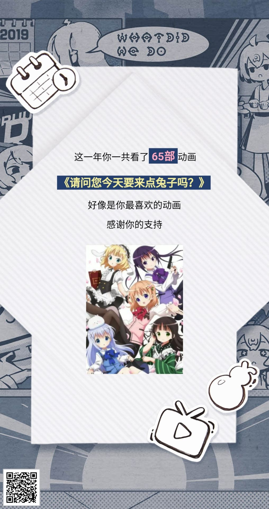

# 目录  <!-- omit in toc -->

- [关于](#%e5%85%b3%e4%ba%8e)
- [动漫列表](#%e5%8a%a8%e6%bc%ab%e5%88%97%e8%a1%a8)
- [反正没人看可以随便写](#%e5%8f%8d%e6%ad%a3%e6%b2%a1%e4%ba%ba%e7%9c%8b%e5%8f%af%e4%bb%a5%e9%9a%8f%e4%be%bf%e5%86%99)
  - [1.《可塑性记忆》](#1%e5%8f%af%e5%a1%91%e6%80%a7%e8%ae%b0%e5%bf%86)
  - [2. &quot;校园f4&quot;](#2-quot%e6%a0%a1%e5%9b%adf4quot)
    - [《冰菓》](#%e5%86%b0%e8%8f%93)
    - [《欢迎来到实力至上教室》](#%e6%ac%a2%e8%bf%8e%e6%9d%a5%e5%88%b0%e5%ae%9e%e5%8a%9b%e8%87%b3%e4%b8%8a%e6%95%99%e5%ae%a4)
    - [《青春猪头少年不会梦到兔女郎学姐》](#%e9%9d%92%e6%98%a5%e7%8c%aa%e5%a4%b4%e5%b0%91%e5%b9%b4%e4%b8%8d%e4%bc%9a%e6%a2%a6%e5%88%b0%e5%85%94%e5%a5%b3%e9%83%8e%e5%ad%a6%e5%a7%90)
    - [《我的青春无语果然有问题》](#%e6%88%91%e7%9a%84%e9%9d%92%e6%98%a5%e6%97%a0%e8%af%ad%e6%9e%9c%e7%84%b6%e6%9c%89%e9%97%ae%e9%a2%98)
  - [３.《某科学的超电磁炮》](#%ef%bc%93%e6%9f%90%e7%a7%91%e5%ad%a6%e7%9a%84%e8%b6%85%e7%94%b5%e7%a3%81%e7%82%ae)
  - [4.《命运石之门》](#4%e5%91%bd%e8%bf%90%e7%9f%b3%e4%b9%8b%e9%97%a8)
    - [5. 《只有我不在的街道》](#5-%e5%8f%aa%e6%9c%89%e6%88%91%e4%b8%8d%e5%9c%a8%e7%9a%84%e8%a1%97%e9%81%93)
    - [6.《re 从零开始的异世界生活》](#6re-%e4%bb%8e%e9%9b%b6%e5%bc%80%e5%a7%8b%e7%9a%84%e5%bc%82%e4%b8%96%e7%95%8c%e7%94%9f%e6%b4%bb)
  - [5. “治愈”](#5-%e6%b2%bb%e6%84%88)
    - [《我们仍未知道那天所看见的花的名字》](#%e6%88%91%e4%bb%ac%e4%bb%8d%e6%9c%aa%e7%9f%a5%e9%81%93%e9%82%a3%e5%a4%a9%e6%89%80%e7%9c%8b%e8%a7%81%e7%9a%84%e8%8a%b1%e7%9a%84%e5%90%8d%e5%ad%97)
    - [《四月是你的谎言》](#%e5%9b%9b%e6%9c%88%e6%98%af%e4%bd%a0%e7%9a%84%e8%b0%8e%e8%a8%80)
    - [《境界的彼方》](#%e5%a2%83%e7%95%8c%e7%9a%84%e5%bd%bc%e6%96%b9)
    - [《魔法少女小圆》](#%e9%ad%94%e6%b3%95%e5%b0%91%e5%a5%b3%e5%b0%8f%e5%9c%86)
  - [６. “笑”](#%ef%bc%96-%e7%ac%91)
  - [7. “狗粮”](#7-%e7%8b%97%e7%b2%ae)
    - [《擅长捉弄人的高木同学》](#%e6%93%85%e9%95%bf%e6%8d%89%e5%bc%84%e4%ba%ba%e7%9a%84%e9%ab%98%e6%9c%a8%e5%90%8c%e5%ad%a6)
    - [《陡然喜欢你》](#%e9%99%a1%e7%84%b6%e5%96%9c%e6%ac%a2%e4%bd%a0)
  - [8. &quot;邪教&quot;](#8-quot%e9%82%aa%e6%95%99quot)
    - [《请问今天也要来点兔子吗》](#%e8%af%b7%e9%97%ae%e4%bb%8a%e5%a4%a9%e4%b9%9f%e8%a6%81%e6%9d%a5%e7%82%b9%e5%85%94%e5%ad%90%e5%90%97)
  - [9. “家长陪同”](#9-%e5%ae%b6%e9%95%bf%e9%99%aa%e5%90%8c)
    - [《缘之空》](#%e7%bc%98%e4%b9%8b%e7%a9%ba)
    - [《日在校园》](#%e6%97%a5%e5%9c%a8%e6%a0%a1%e5%9b%ad)
    - [《柑橘味香气》](#%e6%9f%91%e6%a9%98%e5%91%b3%e9%a6%99%e6%b0%94)
  - [10. 待续](#10-%e5%be%85%e7%bb%ad)

# 关于
想整理一下自己所看的动漫,顺便练一下Markdown。  
文笔？不管，反正自己看。  
错别字？ 尽量吧。

# 动漫列表

以下是我接触过的一些番剧，大部分是看完的，按记忆顺序排序，逃～

**看完了的**
- 《可塑型记忆》
- 小林家的龙女仆
- 冰菓
- 缘之空
- 日在校园
- 柑橘味香气
- 欢迎来到实力之上教室
- 青春猪头少年不会梦到兔女郎学姐
- 我的青春物语果然有问题
- 请问您今天也来点兔子吗
- 干物妹,小埋
- 命运石之门
- 只有我不在的街道
- 某科学的超电磁炮
- 凉宫春日的忧郁
- 漆黑的子弹
- 擅长捉弄人的高木同学
- 中二病也要谈恋爱
- 境界的彼方
- 女高中生的虚度日常
- 四月是你的谎言
- [ ] 男子高中生的日常 
- 天使的心跳
- 伪恋
- 魔法少女小圆
- 陡然喜欢你
- 我们仍未知道那天所看见的花的名字
- 家有女友
- re 从零开始的异世界
- 刀剑神域　
- 深海之蓝
- 夏洛特 （Charlotte）
- fate zero
- 绅士学园
- fate UWB
- 幻想嘉年华

 **没看完的**
- 某科学的一方通行
- 魔法禁书目录
- 珈百璃的堕落
- 辉夜大小姐想让我告白
- clannad
- 游戏人生
- 工作细胞
- 邻家索菲
- 我的妹妹不可能这么可爱
- 埃罗芒阿老师
- 零之使魔
- 天行九歌
- 五等分的新娘 
- 齐神
- 幸运星
- 爱情研究所
- urara迷路贴
- 刀剑神域
- 一起一起这里哪里

**购物车（也就是待看的）**

- 竞女
- 月刊少女野崎君
- 白箱
- 钢之炼金术
- 进击的巨人
- 天使降临我身边
- new game
- 百变小樱魔术卡
- love live school idol project
- 属性咖啡厅
- 龙王的工作
- killer killer
- 亚人酱有话要说
- 魔物娘的同居日常
- 约定的梦幻岛
- 在地下城寻求邂逅是否搞错了
- 少女遇见熊
- 这个美术师有大问题
- 夏日友人帐
- 排球少年
- jojo

# 反正没人看可以随便写

## 1.《可塑性记忆》

入坑番,在上面列表唯一打上书名号以表现Error初恋地位（其实是因为懒-_-）

## 2. "校园f4"

### 《冰菓》
"我很好奇?",女主萌到毁天灭地;整片画风无敌,分分钟截壁纸的那种;没有大事件波澜不惊的推理也能那么有意思;人物刻画都很鲜明,尤其是男二女二的角色形象丝毫不逊主角,这点太可贵了;最高能的是两个人在教师里全集"凭空推理",颇有电影《看不见的客人》的味道;结局表明心意那段也太美了;

### 《欢迎来到实力至上教室》
"只有我一个人不会受伤的世界完成了",一部不错的番,但总觉得看完没什么记住的东西.

### 《青春猪头少年不会梦到兔女郎学姐》
各种有趣的"青春期现象",薛定谔的猫-没被观察就会消失,拨弄时间的色子--不爽就让时间重来好了...把青春期的种种问题加上了脑洞大开的超自然设定,十分有意思.除此之外,此番看点还有男主史诗级的骚话连篇以及教科书级的"撩学姐"操作,男主和学姐间令人羡慕的爱情故事,也有很多令人深思的地方,比如男主和她妹篇，看时我就一直在想生命本质上会不会等价于记忆?

### 《我的青春无语果然有问题》
"只有我一个人受伤的世界完成了",是 "实力教室"的另个极端.F4中目前唯一有第二季的.可能是个人情商原因,有好多情节对话看不太懂,但即使这样我也觉得这部番相当好看.

## ３.《某科学的超电磁炮》
“你指尖跃动的电光 是我此生不变的信仰!”  
2020要出第三季，期待！  
附另外几部不太重要的“前传”或“后传”
- 《魔法禁书目录》
- 《某科学的一方通行》

## 4.《命运石之门》
前期一直在铺垫，挖坑，而且有一些不必要的中二，可能会有点看不下去。  
但撑到撑到十集左右后, 就会感觉前面的忍耐都是值得的。  
亮点是 故事逻辑严谨而富有波折 阐述了关于时间穿梭的很有趣的一个理论。  
“一切都是命运石之门的选择!”

### 5. 《只有我不在的街道》
和石头门对比,该剧的重点没有在穿越的原理和细节,悬疑推理上也不是很深, 更多是在描写正义小伙伴们大战恋童癖怪叔的故事, 并着重墨于细腻的感情描写中. 全作被雏月加代吸引, 狂投加代股, 虽然最后赔的血本无归, 但慢慢也释然了. 该番因为结局的原因被戏称为"只有我被NTR的街道", 但也有人说这部番里有各种细腻的感情,但就是没有爱情, 也没有人被NTR. 虽然加代党的糖吃的十分开心, 但动画里展现出的友情和亲情也十分令人羡慕. 总之,是一部十分值得一看的番.

### 6.《re 从零开始的异世界生活》
这部番我个人的话有两个喜欢的点，一个是蕾姆，一个是男主像一个普通人。看腻了那种完人般的主角，什么“正义的伙伴”之类的，看看有优点缺点也不小的主角，会觉得更真实，代入到故事情节中会更有趣点。

## 5. “治愈”

### 《我们仍未知道那天所看见的花的名字》
ed太好听了 可以说是曾经沧海难为水,看完这部以后看其他所谓的催泪番都相当的平静.

### 《四月是你的谎言》
总觉得以前看过类似的情节,所以开头就猜中了结局,催泪效果也就大打折扣了.玩音乐玩出了战斗番的意味.可惜不懂钢琴和小提琴,全程只能看观众的反应判断弹的好不好听.

### 《境界的彼方》
猜测应该是个催泪番吧,因为我感觉它后期是想催泪的,但我好像,,,,可能是年龄大了,也可能是前期太好笑了，尤其是第6集.

### 《魔法少女小圆》
颠覆对魔法少女的认知,十分治愈. 狗头.jpg 老虚还是名不虚传。

## ６. “笑”
笑就完了，嗯就这样.....

- 《女高中生的虚度日常》
- 《男子高中生的日常》
- 《深海之蓝》
- 《监狱学园》  

## 7. “狗粮”

### 《擅长捉弄人的高木同学》
一部疯狂塞狗粮的番。  
刚看时觉得画风有点奇怪，后面高木太太越看越好看，狗粮也越吃越香。  
真的很羡慕这样的青春时代! 

### 《陡然喜欢你》
和高木同学不一样，这里的粮食不仅量大，而且口味良多。可恶，我一单身狗为什么要看这个!  -> _ -> 

## 8. "邪教"

### 《请问今天也要来点兔子吗》
我好歹堂堂八尺男儿，结果 。。。   

**但是，真好看！**
  - 《干物妹,小埋》
  - 《小林家的龙女仆》
  - 《urara迷路贴》

## 9. “家长陪同”

### 《缘之空》
妹萌文化的代表作之一,看着这部番时还不知道"galgame",觉得这样回到选择点作不同选择有不同故事发展的叙事方式很新颖.最爱巫女线.工口画面好像对情节推进没什么作用,像是完成一条线后给的奖励.另外,对妹妹这条线总觉得不太舒服.

### 《日在校园》
一部著名的工口黑暗番.其实不要把伊藤诚当人,把他当成一个交配道具看这个番体验会好很多.当初是很喜欢桂言叶的这个角色,然后看时就特别难受.后面想想如果对这些女性角色不抱感情的话,就可以格挡掉这些黑暗成分了,专心享受工口. 总的来说, 这部番女性角色感觉没有一个是正常的, 整部番也是,为了猎奇而猎奇,为了黑暗而黑暗, 没啥好看的. 

### 《柑橘味香气》
"橘里橘气"的由来,有"真实战斗指导"的百合番.据说公开版是去掉了少儿不宜的画面以便在正规网站上映,但是只是把镜头切向了环境画面,声音还在! 所谓无声胜有声!

附
- 《监狱学院》
- 《家有女友》

## 10. 待续

