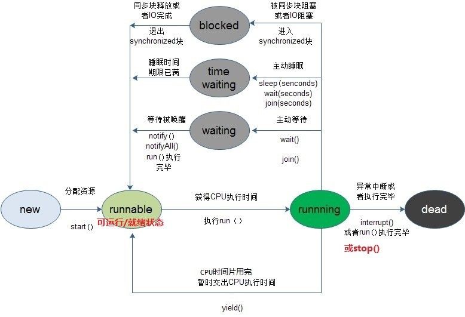

# 问题
1. 自我介绍
2. 熟悉的语言是什么
   * java
3. 用过那些java的容器类
   * HashMap、HashSet、ArrayList、LinkList
4. HashTable与CurrentHashMap的区别
   * HashTable key和value 不能为空值，CurrentHashMap可以
   * CurrentHashMap的加锁的粒度更小，所以性能要高一点
5. 为什么CurrentHashMap性能要高一点
   * 加锁的粒度更小，加在目标桶上，同时其它对其他桶的操作与读取
   * java8以后CurrentHashMap从Synchronized改使用CAS实现，即乐观锁，提高了性能
6. HashMap查询效率特别低的话，总是发生碰撞有什么办法优化
   * 扩容
7. 不能扩容呢，一个链表特别长
   * 把链表转化成查找树，可以实现O(log n)的复杂度
8. 你知道哪些查找树呢，这里用什么好    
    * （突然蒙了），就一般的查找树就好
9. 一般得得得查找树的最坏的复杂度是多少呢
   * O(n)，如果树一边倒的话，相当一个链表
10. 红黑树有了解过吗，这里用红黑树行不行
    * 可以，但是我实现不出来，仅限了解
11. 为什么可以呢
    * 因为红黑树维护这一个性质，根节点到叶节点的路径上有相同的黑色节点，这样保证了平衡性
12. 你知道哪些垃圾回收器
    * （蒙～）
13. 哪些回收算法
    * 新生代和老年代有不同的算法，新生是标记需要回收的，然后直接回收，老年把需要回收的对象移动到一端，然后清除
14. 怎么判断新生代老年代
    * 一般先放在新生代，若干次新生代回收后还没有被回收的话转移到老年代，也有例外，比如大对象可能直接放入到老年代
15. 怎么判断对象需要回收、从哪开始找  
    *  没有引用时，从根节点开始
16. 哪些可以当成根节点
    * 忘了
17. java类加载的过程
    * 不太了解，好像是什么双亲加载模型什么的，就是要加载这个对象前先从父亲代加载，依次递归下去
18. 计算机中段和页知道吗
    * 不了解
19. mysql中有哪些引擎
    * MyIsam Innodb ，My不支持事务安全，使用文件保存，方便转移，粒度表级，更适合查询，适合小型项目，Innodb支持事务安全、粒度行级、写效率高，适合复杂的项目
20. Innodb 使用什么索引
    * 懵，好像是B+树  
21. 为什么使用B+树，B+树有什么特点
    * 这里答乱七八糟、略
22. B+树为什么把所有放在叶节点
    * 维护树的平衡性，降低树的高度
23. 有用过哪些Nosql，各自有什么特点
24. 问了一个项目
25. 通过短信给用户发送一个长链接，但短信长度有限，可能链接放不下你怎么解决
    * 使用t.cn类似的短链接
26. 你实现这个t.cn的功能
    * 可以后台生成一个Host+编号的短连接，然后重定向到对应的长链接，编号的方式可以采用时间戳
27. 要求生成链接是杂乱的，不要暴露编号
    * 比如只使用小写字母和大写字母，就可以得到一个52进制的表示方法，如a表示1，z表示26，az表示53+26=79
26. 你有什么问题问我吗
    * 你们后端开发一般用什么
       * java的多一点，也有c++等其他语言
    * 今晚表现的最差的一点是哪里
       * 作为应届生，虽然课程没教，但基础的还是应该学好一点（这里应该指段和页那题，我说的是没上过计算级系统这门课，可能和其他基础没打出来也有关系，这言外之意就是“你基础不太行”，所以理论上应该没有二面了）
  
# 总结
果然又败在了基础部分。这次面试心态还可以，这么多没答出来，依然面不改色，这是进步点，当然也有面试官氛围维持好的原因。
# 重现

## 计算机中的段和页  
一个段中包含若干页，在段式存储管理中，将程序的地址空间划分为若干段（segment），如代码段，数据段，堆栈段；这样每个进程有一个二维地址空间，相互独立，互不干扰。段式管理的优点是：没有内碎片（因为段大小可变，改变段大小来消除内碎片）。但段换入换出时，会产生外碎片（比如4k的段换5k的段，会产生1k的外碎片）。  
在页式存储管理中，将程序的逻辑地址划分为固定大小的页（page），而物理内存划分为同样大小的页框，程序加载时，可以将任意一页放入内存中任意一个页框，这些页框不必连续，从而实现了离散分离。页式存储管理的优点是：没有外碎片（因为页的大小固定），但会产生内碎片（一个页可能填充不满）  
两者结合——段页式存储管理：内存分为几个段，每个段分为大小相同的页，主存分配以页为单位。地址结构：段号、页号、页内偏移量。每个进程一个段表，每个段一个页表。  
2．地址变换的过程：
（1）程序执行时，从PCB中取出段表始址和段表长度，装入段表寄存器。
（2）由地址变换机构将逻辑地址自动分成段号、页号和页内地址。
（3）将段号与段表长度进行比较，若段号大于或等于段表长度，则表示本次访问的地址已超越进程的地址空间，产生越界中断。
（4）将段表始址与段号和段表项长度的乘积相加，便得到该段表项在段表中的位置。
（5）取出段描述子得到该段的页表始址和页表长度。
（6）将页号与页表长度进行比较，若页号大于或等于页表长度，则表示本次访问的地址已超越进程的地址空间，产生越界中断。
（7）将页表始址与页号和页表项长度的乘积相加，便得到该页表项在页表中的位置。
（8）取出页描述子得到该页的物理块号。
（9）对该页的存取控制进行检查。
（10）将物理块号送入物理地址寄存器中，再将有效地址寄存器中的页内地址直接送入物理地址寄存器的块内地址字段中，拼接得到实际的物理地址。
***  
## 操作系统相关知识  
1. 进程间的通信的几种方式  
   * 管道（pipe）及命名管道（named pipe）：管道可用于具有亲缘关系的父子进程间的通信，有名管道除了具有管道所具有的功能外，它还允许无亲缘关系进程间的通信；
   * 信号（signal）：信号是一种比较复杂的通信方式，用于通知接收进程某个事件已经发生；

   * 消息队列：消息队列是消息的链接表，它克服了上两种通信方式中信号量有限的缺点，具有写权限得进程可以按照一定得规则向消息队列中添加新信息；对消息队列有读权限得进程则可以从消息队列中读取信息；

   * 共享内存：可以说这是最有用的进程间通信方式。它使得多个进程可以访问同一块内存空间，不同进程可以及时看到对方进程中对共享内存中数据得更新。这种方式需要依靠某种同步操作，如互斥锁和信号量等；

   * 信号量：主要作为进程之间及同一种进程的不同线程之间得同步和互斥手段；

   * 套接字：这是一种更为一般得进程间通信机制，它可用于网络中不同机器之间的进程间通信，应用非常广泛。  
2. 进程状态
   * 就绪状态，已获得除cpu的所需资源
   * 运行状态，处于此状态的进程数不大于cpu数
   * 阻塞状态
3. 进程调度策略
   * FCFS：先来的先得
   * SJF ：最短作业优先调度算法，使平均等待时间最短
   * 优先级调度算法，优先级越高越先分配，相同优先级先到先得，问题是低优先级线程可能会饿死，即无限等待
   * 时间片轮转调度算法： 每个轮流使用一个时间片后，放回就绪队列
   * 多级队列调度算发：将就绪对列分成多个独立的队列，队列间按优先级抢占调度
   * 多级反馈队列调度算法
4. 进程同步机制
原子操作
信号量操作
自旋锁管程
回合
分布式系统
***  
线程同步方式  
* 互斥量：只有拥有互斥对象的线程才有访问公共资源的权限。
* 信号量：允许多个线程同一时刻访问同一资源，但是需要控制同一时刻访问此资源的最大线程数量。
- 事件（信号）：通知操作保持多线程同步
  
线程状态：
创建
就绪
运行
阻塞
等待
时间等待
终止

*** 
死锁
1. 概念  
在两个或者多个并发进程中，如果每个进程持有某种资源而又等待其它进程释放它或它们现在保持着的资源，在未改变这种状态之前都不能向前推进，称这一组进程产生了死锁。通俗的讲，就是两个或多个进程无限期的阻塞、相互等待的一种状态。  
2. 产生死锁的4个必要条件
   * 互斥：至少有一个资源一次只能被一个进程占有
   * 占有等待：一个进程占有至少一个资源，并等待另一个被其他进程占有的资源
   * 非抢占：资源只能在进程完成后资源释放
   * 循环等待：若干进程形成环形等待关系
3. 死锁处理
   * 预防
   * 避免，动态检测资源状态
   * 解除，进程终止，资源抢占  
***
虚拟内存
1. 页面置换算法
   * FIFO先进先出算法
   * LRU 最少使用算法：根据使用时间
   * LFU 最少使用次数算法
   * OPT 最有置换算法 理论最优，保证置换出去的的页是不再使用的页
## java类的加载过程
1. 加载  
2. 验证  
文件格式验证：验证字节流是否符合Class文件规范  
元数据验证：对字节流进行语义分析，是否符合java语言语法的规范  
字节码验证：分析数据流和控制，保证该类不会危害虚拟机  
符号引用验证：对常量池中中各种符号引用进行匹配性校验
3. 准备
为类变量进行内存分配设置初始值为0（0，null，false等），这些内存在方法区分配  
但是如果变量被static final ,则在准备阶段就被初始化。  **可以理解为放入调动它的类的常量池中** 
4. 解析  
讲常量池中的符号引用转化为直接引用。可能在之前也可能在之后开始。  
   * 类或接口
   * 字段解析
   * 类方法解析
   * 接口方法解析
5. 初始化
虚拟机规范严格规定了有且只有四种情况必须立即对类进行初始化：
   * 遇到new、getstatic、putstatic、invokestatic这四条字节码指令时，如果类还没有进行过初始化，则需要先触发其初始化。生成这四条指令最常见的Java代码场景是：使用new关键字实例化对象时、读取或设置一个类的静态字段（static）时（被static修饰又被final修饰的，已在编译期把结果放入常量池的静态字段除外）、以及调用一个类的静态方法时。
   * 使用Java.lang.refect包的方法对类进行反射调用时，如果类还没有进行过初始化，则需要先触发其初始化。
   * 当初始化一个类的时候，如果发现其父类还没有进行初始化，则需要先触发其父类的初始化。
   * 当虚拟机启动时，用户需要指定一个要执行的主类，虚拟机会先执行该主类。
*** 
## jvm垃圾回收

***
##参考
