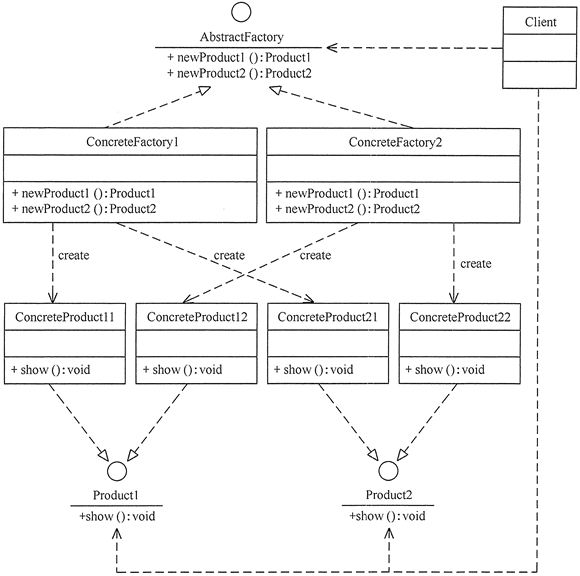

- [一. Java知识总结](#%e4%b8%80-java%e7%9f%a5%e8%af%86%e6%80%bb%e7%bb%93)
  - [1. java 4 特征：抽象、封装、继承、多态;](#1-java-4-%e7%89%b9%e5%be%81%e6%8a%bd%e8%b1%a1%e5%b0%81%e8%a3%85%e7%bb%a7%e6%89%bf%e5%a4%9a%e6%80%81)
  - [2. 六大原则：](#2-%e5%85%ad%e5%a4%a7%e5%8e%9f%e5%88%99)
    - [单一职责](#%e5%8d%95%e4%b8%80%e8%81%8c%e8%b4%a3)
    - [开闭](#%e5%bc%80%e9%97%ad)
    - [里氏替换](#%e9%87%8c%e6%b0%8f%e6%9b%bf%e6%8d%a2)
    - [依赖倒置](#%e4%be%9d%e8%b5%96%e5%80%92%e7%bd%ae)
    - [合成聚合复用](#%e5%90%88%e6%88%90%e8%81%9a%e5%90%88%e5%a4%8d%e7%94%a8)
    - [接口隔离](#%e6%8e%a5%e5%8f%a3%e9%9a%94%e7%a6%bb)
    - [狄米特法则](#%e7%8b%84%e7%b1%b3%e7%89%b9%e6%b3%95%e5%88%99)
  - [3. 23种设计模式](#3-23%e7%a7%8d%e8%ae%be%e8%ae%a1%e6%a8%a1%e5%bc%8f)
    - [分类](#%e5%88%86%e7%b1%bb)
    - [单例模式](#%e5%8d%95%e4%be%8b%e6%a8%a1%e5%bc%8f)
    - [原型模式](#%e5%8e%9f%e5%9e%8b%e6%a8%a1%e5%bc%8f)
    - [工厂模式](#%e5%b7%a5%e5%8e%82%e6%a8%a1%e5%bc%8f)
      - [简单工厂](#%e7%ae%80%e5%8d%95%e5%b7%a5%e5%8e%82)
      - [工厂方法](#%e5%b7%a5%e5%8e%82%e6%96%b9%e6%b3%95)
      - [抽象工厂](#%e6%8a%bd%e8%b1%a1%e5%b7%a5%e5%8e%82)
    - [建造者模式](#%e5%bb%ba%e9%80%a0%e8%80%85%e6%a8%a1%e5%bc%8f)
    - [代理模式](#%e4%bb%a3%e7%90%86%e6%a8%a1%e5%bc%8f)
    - [适配器模式](#%e9%80%82%e9%85%8d%e5%99%a8%e6%a8%a1%e5%bc%8f)
    - [桥接模式](#%e6%a1%a5%e6%8e%a5%e6%a8%a1%e5%bc%8f)
    - [观察者模式](#%e8%a7%82%e5%af%9f%e8%80%85%e6%a8%a1%e5%bc%8f)
  - [4. jvm 内容](#4-jvm-%e5%86%85%e5%ae%b9)
    - [常见的GC种类](#%e5%b8%b8%e8%a7%81%e7%9a%84gc%e7%a7%8d%e7%b1%bb)
      - [serial(串行)](#serial%e4%b8%b2%e8%a1%8c)
      - [parNew](#parnew)
      - [parallel Scavebge](#parallel-scavebge)
      - [serial old](#serial-old)
      - [parallel old](#parallel-old)
      - [CMS](#cms)
    - [Minor GC 和Full GC](#minor-gc-%e5%92%8cfull-gc)
    - [新生代老年代](#%e6%96%b0%e7%94%9f%e4%bb%a3%e8%80%81%e5%b9%b4%e4%bb%a3)
    - [4种可作为GC root的对象](#4%e7%a7%8d%e5%8f%af%e4%bd%9c%e4%b8%bagc-root%e7%9a%84%e5%af%b9%e8%b1%a1)
    - [什么情况下判断需要调整新生带的大小](#%e4%bb%80%e4%b9%88%e6%83%85%e5%86%b5%e4%b8%8b%e5%88%a4%e6%96%ad%e9%9c%80%e8%a6%81%e8%b0%83%e6%95%b4%e6%96%b0%e7%94%9f%e5%b8%a6%e7%9a%84%e5%a4%a7%e5%b0%8f)
    - [jvm的常见参数](#jvm%e7%9a%84%e5%b8%b8%e8%a7%81%e5%8f%82%e6%95%b0)
  - [static & final](#static--final)
    - [hashtable、hashmap、currenthashmap:](#hashtablehashmapcurrenthashmap)
    - [序列化：](#%e5%ba%8f%e5%88%97%e5%8c%96)
    - [多线程：](#%e5%a4%9a%e7%ba%bf%e7%a8%8b)
- [二. 数据库知识](#%e4%ba%8c-%e6%95%b0%e6%8d%ae%e5%ba%93%e7%9f%a5%e8%af%86)
      - [ACID](#acid)
      - [脏读、不可重复读、幻读](#%e8%84%8f%e8%af%bb%e4%b8%8d%e5%8f%af%e9%87%8d%e5%a4%8d%e8%af%bb%e5%b9%bb%e8%af%bb)
      - [索引](#%e7%b4%a2%e5%bc%95)
      - [MyISAM和InnoDB](#myisam%e5%92%8cinnodb)
        - [分页查询](#%e5%88%86%e9%a1%b5%e6%9f%a5%e8%af%a2)
- [三. 计算机网络知识](#%e4%b8%89-%e8%ae%a1%e7%ae%97%e6%9c%ba%e7%bd%91%e7%bb%9c%e7%9f%a5%e8%af%86)
  - [协议三要素](#%e5%8d%8f%e8%ae%ae%e4%b8%89%e8%a6%81%e7%b4%a0)
  - [http与https的区别](#http%e4%b8%8ehttps%e7%9a%84%e5%8c%ba%e5%88%ab)
  - [TCP可靠传输&三次握手&四此挥手](#tcp%e5%8f%af%e9%9d%a0%e4%bc%a0%e8%be%93%e4%b8%89%e6%ac%a1%e6%8f%a1%e6%89%8b%e5%9b%9b%e6%ad%a4%e6%8c%a5%e6%89%8b)
  - [DDOS攻击](#ddos%e6%94%bb%e5%87%bb)
  - [GET&POST](#getpost)
  - [OSI模型](#osi%e6%a8%a1%e5%9e%8b)
    - [6. 网络层](#6-%e7%bd%91%e7%bb%9c%e5%b1%82)
    - [7. 数据链路层](#7-%e6%95%b0%e6%8d%ae%e9%93%be%e8%b7%af%e5%b1%82)
      - [7.1 多路访问控制协议MAC](#71-%e5%a4%9a%e8%b7%af%e8%ae%bf%e9%97%ae%e6%8e%a7%e5%88%b6%e5%8d%8f%e8%ae%aemac)
      - [7.2 ARP协议](#72-arp%e5%8d%8f%e8%ae%ae)
  - [TCP快速重传](#tcp%e5%bf%ab%e9%80%9f%e9%87%8d%e4%bc%a0)
  - [5类ip地址](#5%e7%b1%bbip%e5%9c%b0%e5%9d%80)
  - [剑指off](#%e5%89%91%e6%8c%87off)
# 一. Java知识总结

## 1. java 4 特征：抽象、封装、继承、多态;
重载：方法同名，参数不同;参数类型、或个数不同，或顺序不同
重写：比父类更好访问，最好不要额外申明异常（里氏替换原则），其他返回类型，参数都要相同;

## 2. 六大原则：

### 单一职责
该原则提出对象不应该承担太多职责，如果一个对象承担了太多的职责，至少存在以下两个缺点：一个职责的变化可能会削弱或者抑制这个类实现其他职责的能力；当客户端需要该对象的某一个职责时，不得不将其他不需要的职责全都包含进来，从而造成冗余代码或代码的浪费

### 开闭
对扩展开放,对修改关闭  

### 里氏替换
父类所拥有的性质在子类仍然成立,即子类可以扩展父类的功能,但不能改变父类原有的功能. 

### 依赖倒置
高层模块不应该依赖低层模块，两者都应该依赖其抽象；抽象不应该依赖细节，细节应该依赖抽象  

### 合成聚合复用
它要求在软件复用时，要尽量先使用组合或者聚合等关联关系来实现，其次才考虑使用继承关系来实现。

### 接口隔离
要求程序员尽量将臃肿庞大的接口拆分成更小的和更具体的接口，让接口中只包含客户感兴趣的方法。  
接口隔离原则和单一职责都是为了提高类的内聚性、降低它们之间的耦合性，体现了封装的思想，但两者是不同的：
单一职责原则注重的是职责，而接口隔离原则注重的是对接口依赖的隔离。
单一职责原则主要是约束类，它针对的是程序中的实现和细节；接口隔离原则主要约束接口，主要针对抽象和程序整体框架的构建。

### 狄米特法则
如果两个软件实体无须直接通信，那么就不应当发生直接的相互调用，可以通过第三方转发该调用。其目的是降低类之间的耦合度，提高模块的相对独立性。

## 3. 23种设计模式
***
### 分类
- 创建型模式
  - 单例模式
  - 原型模式
  - 工厂模式
  - 建造者模式
- 结构型模式
  - 代理
  - 适配器
  - 桥接
  - 装饰
  - 外观
  - 享元
  - 组合
- 行为型模式
  - 模版方法
  - 策略
  - 命令
  - 职责链
  - 观察者
  - 中介者
  - 迭代器
  - 备忘录
  - 解释器


### 单例模式

只产生一个实例，内部新建一个实例，通过static方法返回这个实例

### 原型模式

复制实例以创建实例

### 工厂模式

#### 简单工厂

#### 工厂方法
主要角色有:抽象工厂,具体工厂,抽象产品,具体产品  
每个具体工厂对应着具体产品

#### 抽象工厂
可生产多个等级的产品  
  

### 建造者模式
将一个复杂的对象分解为多个简单的对象,然后一步一步构建而成. 主要角色有产品, 抽象建造者, 具体建造者, 指挥者


### 代理模式
代理模式的主要角色如下。  
抽象主题（Subject）类：通过接口或抽象类声明真实主题和代理对象实现的业务方法。  
真实主题（Real Subject）类：实现了抽象主题中的具体业务，是代理对象所代表的真实对象，是最终要引用的对象。  
代理（Proxy）类：提供了与真实主题相同的接口，其内部含有对真实主题的引用，它可以访问、控制或扩展真实主题的功能。


### 适配器模式
将一个类的接口转换成客户希望的另外一个接口，使得原本由于接口不兼容而不能一起工作的那些类能一起工作。适配器模式分为类结构型模式和对象结构型模式两种，前者类之间的耦合度比后者高，且要求程序员了解现有组件库中的相关组件的内部结构，所以应用相对较少些。

类适配器  
  
对象适配器  


### 桥接模式
将抽象与实现分离，使它们可以独立变化。它是用组合关系代替继承关系来实现，从而降低了抽象和实现这两个可变维度的耦合度。  
可以将抽象化部分与实现化部分分开，取消二者的继承关系，改用组合关系。  
模式的结构  
桥接（Bridge）模式包含以下主要角色。
抽象化（Abstraction）角色：定义抽象类，并包含一个对实现化对象的引用。
扩展抽象化（Refined    Abstraction）角色：是抽象化角色的子类，实现父类中的业务方法，并通过组合关系调用实现化角色中的业务方法。
实现化（Implementor）角色：定义实现化角色的接口，供扩展抽象化角色调用。    
具体实现化（Concrete Implementor）角色：给出实现化角色接口的具体实现。
  
桥接模式通常适用于以下场景。  
当一个类存在两个独立变化的维度，且这两个维度都需要进行扩展时。  
当一个系统不希望使用继承或因为多层次继承导致系统类的个数急剧增加时。  
当一个系统需要在构件的抽象化角色和具体化角色之间增加更多的灵活性时。  
### 观察者模式

观察对象接口（+observerList、-add、-remove、-change)  
观察者接口：（-change）  
当观察者对象改变时调用change函数，遍历调用observerList的观察者的change函数  
主要角色有:抽象主题, 具体主题, 抽象观察者, 具体观察者  
  
<br>
实现代码如下
```java
package observer;
import java.util.*;
public class ObserverPattern
{
    public static void main(String[] args)
    {
        Subject subject=new ConcreteSubject();
        Observer obs1=new ConcreteObserver1();
        Observer obs2=new ConcreteObserver2();
        subject.add(obs1);
        subject.add(obs2);
        subject.notifyObserver();
    }
}
//抽象目标
abstract class Subject
{
    protected List<Observer> observers=new ArrayList<Observer>();   
    //增加观察者方法
    public void add(Observer observer)
    {
        observers.add(observer);
    }    
    //删除观察者方法
    public void remove(Observer observer)
    {
        observers.remove(observer);
    }   
    public abstract void notifyObserver(); //通知观察者方法
}
//具体目标
class ConcreteSubject extends Subject
{
    public void notifyObserver()
    {
        System.out.println("具体目标发生改变...");
        System.out.println("--------------");       
       
        for(Object obs:observers)
        {
            ((Observer)obs).response();
        }
       
    }          
}
//抽象观察者
interface Observer
{
    void response(); //反应
}
//具体观察者1
class ConcreteObserver1 implements Observer
{
    public void response()
    {
        System.out.println("具体观察者1作出反应！");
    }
}
//具体观察者1
class ConcreteObserver2 implements Observer
{
    public void response()
    {
        System.out.println("具体观察者2作出反应！");
    }
}

```
## 4. jvm 内容

### 常见的GC种类
  
注意:有连线表示可以搭配使用  

#### serial(串行)
- 针对新生代
- 复制算法
- 单线程
- 必须停止所有工作线程即"Stop the word"
- 多应用于client模式

#### parNew
- serial的多线程版本
- 除多线程特点外和serial一样
- 多应用于server模式

#### parallel Scavebge
- 吞吐量收集器
- 复制算法
- 多线程
- 目标是达到可控的吞吐量(吞吐量=运行用户代码时间/(运行用户代码时间+垃圾收集时间))
- 减少垃圾收集时间,以让用户代码获得更长的运行时间

#### serial old 
- serial的老年代版本
- 老年代
- 单线程
- 标记整理(有压缩)
- 主要client模式
  
#### parallel old
- parallel Scavenge的老年代版本
- 标记整理
- 多线程 

#### CMS
- 并发标记清理 低停顿 低延迟

- 标记清除算法(不压缩,产生内存碎片)

- 消耗更多内存
  
```
  1、初始标记
  只是标记一下 GC Roots 能直接关联的对象,速度很快,仍然需要暂停所有的工作线程。
  2、并发标记
  进行 GC Roots 跟踪的过程,和用户线程一起工作,不需要暂停工作线程。
  3、重新标记
  为了修正在并发标记期间,因用户程序继续运行而导致标记产生变动的那一部分对象的标记记录,仍然需要暂停所有的工作线程。
  4、并发清除
  清除 GC Roots 不可达对象,和用户线程一起工作,不需要暂停工作线程。由于耗时最长的并
  发标记和并发清除过程中,垃圾收集线程可以和用户现在一起并发工作,所以总体上来看
  CMS 收集器的内存回收和用户线程是一起并发地执行。
```

#### G1 收集器

  Garbage first 垃圾收集器是目前垃圾收集器理论发展的最前沿成果,相比与 CMS 收集器,G1 收
  集器两个最突出的改进是:

  1. 基于标记-整理算法,不产生内存碎片。
  2. 可以非常精确控制停顿时间,在不牺牲吞吐量前提下,实现低停顿垃圾回收。
    G1 收集器避免全区域垃圾收集,它把堆内存划分为大小固定的几个独立区域,并且跟踪这些区域
    的垃圾收集进度,同时在后台维护一个优先级列表,每次根据所允许的收集时间,优先回收垃圾
    最多的区域。区域划分和优先级区域回收机制,确保 G1 收集器可以在有限时间获得最高的垃圾收
    集效率。

### Minor GC 和Full GC
MinorGC 是发生在新生代的GC  
FullGC也称MajorGC,是发生在老年代的GC

### 新生代老年代
一般新生代:老年代=1:2  
新生代包含,Eden:servivor:servivor=8:1:1, 新生代因为对象"朝生夕死"故采用"复制清除法",把Eden和一个servivor区域的存活对象复制到另一个servivor区域,两个servivor交替使用,即第一次minorGC时把Eden和servivor1的存活对象复制到servivor2,第二次就把Eden和servivor2的的存活对象复制到servivor1中,依次交替下.  
老年代,一般使用标记整理法.对象放入老年代的原因可能有
- minorgc中servivor满了还未放进去的对象
- 大对象
- 经过多次minorGC还存活的对象(一般16次)
- servivor超过一半对象是某个年龄的对象(minor经历过GC的次数称为年龄),那么大于该年龄的对象会直接进入老年代

### 4种可作为GC root的对象
虚拟机栈中引用的对象
方法区静态属性引用的对象
方法区常量引用的对象
本地方法栈中JNI(即一般说的Native方法)引用的对象

### 4种引用类型

**强引用**

Java中默认声明的就是强引用，比如：

```java
Object obj = new Object(); //只要obj还指向Object对象，Object对象就不会被回收
obj = null;  //手动置null
```

只要强引用存在，垃圾回收器将永远不会回收被引用的对象，哪怕内存不足时，JVM也会直接抛出OutOfMemoryError，不会去回收。如果想中断强引用与对象之间的联系，可以显示的将强引用赋值为null，这样一来，JVM就可以适时的回收对象了

**软引用**

软引用是用来描述一些非必需但仍有用的对象。**在内存足够的时候，软引用对象不会被回收，只有在内存不足时，系统则会回收软引用对象，如果回收了软引用对象之后仍然没有足够的内存，才会抛出内存溢出异常**。这种特性常常被用来实现缓存技术，比如网页缓存，图片缓存等。
在 JDK1.2 之后，用java.lang.ref.SoftReference类来表示软引用。

下面以一个例子来进一步说明强引用和软引用的区别：
在运行下面的Java代码之前，需要先配置参数 -Xms2M -Xmx3M，将 JVM 的初始内存设为2M，最大可用内存为 3M。

首先先来测试一下强引用，在限制了 JVM 内存的前提下，下面的代码运行正常

```java
public class TestOOM {
    
    public static void main(String[] args) {
         testStrongReference();
    }
    private static void testStrongReference() {
        // 当 new byte为 1M 时，程序运行正常
        byte[] buff = new byte[1024 * 1024 * 1];
    }
}
```

但是如果我们将

```java
byte[] buff = new byte[1024 * 1024 * 1];
```

替换为创建一个大小为 2M 的字节数组

```java
byte[] buff = new byte[1024 * 1024 * 2];
```

则内存不够使用，程序直接报OOM，强引用并不会被回收

接着来看一下软引用会有什么不一样，在下面的示例中连续创建了 10 个大小为 1M 的字节数组，并赋值给了软引用，然后循环遍历将这些对象打印出来。

```java
public class TestOOM {
    private static List<Object> list = new ArrayList<>();
    public static void main(String[] args) {
         testSoftReference();
    }
    private static void testSoftReference() {
        for (int i = 0; i < 10; i++) {
            byte[] buff = new byte[1024 * 1024];
            SoftReference<byte[]> sr = new SoftReference<>(buff);
            list.add(sr);
        }
        
        System.gc(); //主动通知垃圾回收
        
        for(int i=0; i < list.size(); i++){
            Object obj = ((SoftReference) list.get(i)).get();
            System.out.println(obj);
        }
        
    }
    
}
```

我们发现无论循环创建多少个软引用对象，打印结果总是只有最后一个对象被保留，其他的obj全都被置空回收了。
这里就说明了在内存不足的情况下，软引用将会被自动回收。
值得注意的一点 , 即使有 byte[] buff 引用指向对象, 且 buff 是一个strong reference, 但是 SoftReference sr 指向的对象仍然被回收了，这是因为Java的编译器发现了在之后的代码中, buff 已经没有被使用了, 所以自动进行了优化。
如果我们将上面示例稍微修改一下：

```java
    private static void testSoftReference() {
        byte[] buff = null;

        for (int i = 0; i < 10; i++) {
            buff = new byte[1024 * 1024];
            SoftReference<byte[]> sr = new SoftReference<>(buff);
            list.add(sr);
        }

        System.gc(); //主动通知垃圾回收
        
        for(int i=0; i < list.size(); i++){
            Object obj = ((SoftReference) list.get(i)).get();
            System.out.println(obj);
        }

        System.out.println("buff: " + buff.toString());
    }
```

则 buff 会因为强引用的存在，而无法被垃圾回收，从而抛出OOM的错误。

如果一个对象惟一剩下的引用是软引用，那么该对象是软可及的（softly reachable）。垃圾收集器并不像其收集弱可及的对象一样尽量地收集软可及的对象，相反，它只在真正 “需要” 内存时才收集软可及的对象。

**弱引用**

弱引用的引用强度比软引用要更弱一些，**无论内存是否足够，只要 JVM 开始进行垃圾回收，那些被弱引用关联的对象都会被回收**。在 JDK1.2 之后，用 java.lang.ref.WeakReference 来表示弱引用。
我们以与软引用同样的方式来测试一下弱引用：

```java
    private static void testWeakReference() {
        for (int i = 0; i < 10; i++) {
            byte[] buff = new byte[1024 * 1024];
            WeakReference<byte[]> sr = new WeakReference<>(buff);
            list.add(sr);
        }
        
        System.gc(); //主动通知垃圾回收
        
        for(int i=0; i < list.size(); i++){
            Object obj = ((WeakReference) list.get(i)).get();
            System.out.println(obj);
        }
    }
```

打印结果：全部为null

可以发现所有被弱引用关联的对象都被垃圾回收了。


**虚引用**

虚引用是最弱的一种引用关系，如果一个对象仅持有虚引用，那么它就和没有任何引用一样，它随时可能会被回收，在 JDK1.2 之后，用 PhantomReference 类来表示，通过查看这个类的源码，发现它只有一个构造函数和一个 get() 方法，而且它的 get() 方法仅仅是返回一个null，也就是说将永远无法通过虚引用来获取对象，虚引用必须要和 ReferenceQueue 引用队列一起使用。

```java
public class PhantomReference<T> extends Reference<T> {
    /**
     * Returns this reference object's referent.  Because the referent of a
     * phantom reference is always inaccessible, this method always returns
     * <code>null</code>.
     *
     * @return  <code>null</code>
     */
    public T get() {
        return null;
    }
    public PhantomReference(T referent, ReferenceQueue<? super T> q) {
        super(referent, q);
    }
    }
```

主要作用是跟踪对象被垃圾回收的状态

### 什么情况下判断需要调整新生带的大小

笨想一下,新生代最好每次minorGC最好大部分对象已经"死去",这样对新生代采用的"复制清除算法"更有利.

### jvm的常见参数
参数|作用|其他
-|-|-
-verbose:gc -XX:+printGC| 打印GC的简要信息
-XX:+PrintGCDetails|打印GC详细信息
-XX:+PrintGCTimeStamps|打印GC发生的时间戳
-Xlog:\<path> |指定GClog的的位置,文件输出log
-XX:TraceClassLoading|监控类的的加载
-XX:+PrintClassHistogram|按下Ctr+Break后,打印类的信息
-Xmx -Xms|指定最大堆,最小堆|默认(MinHeapFreeRatio参数可以调整)空余堆内存小于40%时，JVM就会增大堆直到-Xmx的最大限制.空余堆内存大于70%时，JVM会减少堆直到 -Xms的最小限制
-XX:NewRatio|表示老年代:新生代的比值
-XX:SurivorRatio| eden:survivor的值
-XX:+HeapDumpOnOutOfMemoryError|OOM时导出堆到文件
-XX:+HeapDumpPath|导出OOM的路径
-Xss|设置栈的大小
-XX:PermSize|永久区的初始空间
-XX:MaxPermSize|永久区的最大空间
-XX:OnOutOfMemoryError|在OOM时执行一个脚本

## static & final
static:
- 变量：类加载时被初始话，内存中只有一个;
- 方法：不能引用非static的方法或变量、必须实现;  
- 因为static是成员变量是gcRoot,不会随着该类new出来的对象回收而回收
static 变量在内存只有一个实体, 如下述代码中, 三个输出结果皆为2. 
```java
public class Test {
    public static void main(String[] args) {
        ChildrenMySort.anInt=0;
        ChildrenMySort childrenMySort=new ChildrenMySort();
        ChildrenMySort childrenMySort2=new ChildrenMySort();
        childrenMySort.anInt=1;
        childrenMySort2.anInt=2;
        System.out.println(ChildrenMySort.anInt);
        System.out.println(childrenMySort.anInt);
        System.out.println(childrenMySort2.anInt);
    }
}

```
final ：
- 变量：类加载初始化，不可改变或引用不可变;
- 方法：不能被被子类重写;类：不能被继承;
- 形参：不能被子类修改;
- final修饰的成员变量是gcroot 不会随改类定义的对象回收而回收;

### hashtable、hashmap、currenthashmap:

线程安全：table安全，current安全而且效率更高，因为划分粒度更小，将哈希桶分段加锁;map不线程安全
null：table不允许空值，map允许，key和value都包括;
遍历：table使用枚举类，map使用迭代类
父类：table是Dictionary类，map继承AbstractMap
哈希值使用：table直接使用hashcode，map对hashcode在hash()
map的初始容量16 转化因子0.75

String +String 实际转化成stringbuild 的append（）

### 序列化：

TODO
将对象转化成字节序列，java远程调用，javabean。序列化内容：类名、属性，static属性不序列化、方法不序列化;反序列花：需要对应的class文件，实现ExternalSerialble的会调用构造方法，seriable不会;transient关键字修饰不必序列花的属性。

### 多线程：

TODO
三种方式：
继承Thread类，重写run函数
runable接口
callable接口 有返回值
线程安全：
volitate
synchronized
lock

线程池：

java内存泄露与溢出

# 二. 数据库知识

#### ACID

原子性：保证事务中的所有操作全部或全部不执行

一致性： 保持系统处于一致的状态

隔离性： 多事务并发执行 ，结果与多个事务串行效果一致

持久性：事物务操作后，对数据库的影响是持久的，即使数据库因故障而受到破坏。

#### 脏读、不可重复读、幻读

脏读：T1更新了一行记录的内容、但是没有提交、T2读取更新的行，然后T1回滚，T2就无效了。

不可重复读：T1读取一行，T2修改该行，T1又再次读取这行，发现与读取的结果不同

幻读：T1根据条件索引到N条数据，T2增添了M条数据，T1再次搜索发现幻读

#### 索引

#### MyISAM和InnoDB

m非事务安全，i事务安全

m粒度表级，i行级

m支持全文类型索引，而I不支持

m相对简单，效率高，适合小型应用

m表保存为文件格式，数据转移简单

i更安全

m适合查询，i适合修改

##### 分页查询

select * from table limit m offset n;

# 三. 计算机网络知识

## 协议三要素

语法、语义、时序

DNS 查询：迭代、递归

格式：（name,value,type,type,ttl）

Type=A name 主机域名 value Ip地址

Ns  域 该域权威域名解析服务器的主机域名

chame 真实域名的别名 真实域名

MX valueiname相对应的邮件服务器

## http与https的区别

http-TCP 80 

https-SSL/TLS-TCP 443 需要证书，一般收费

## TCP可靠传输&三次握手&四此挥手

可靠：数据包校验、超时重传、流量控制 

三次：c反送SYN包 x 、s发送SYN ACK ack=x+1 编号 y 、c发送ACK  ack=y+1

四次：c发送FIN 编号m 、s发送ack m+1 、s发送FIN n、c发送ack n+1

## DDOS攻击

一直握2次手，不握第三次

## GET&POST

三get：数据小，不能发大量数据，请求不安全，幂等，

post：不能被缓存、安全、稳定可靠、数据量无限制

## OSI模型

- 应用层
- 表示层
- 会话层
- 传输层
- 网络层
- 数据链路层
- 物理层

### 6. 网络层
核心功能: 转发与路由


### 7. 数据链路层
负责通过一条链路从一个节点向另一个物理链路直接相连的相邻节点传送数据报  
功能:
- 组帧
- 链路接入,在共享介质中需要信道接入
- 可靠交付,有线链路很少采用,无线链路误码率高故需采用
- 流量控制
- 差错检测 接收端通知重传或直接丢弃
- 差错纠正 接收端直接纠正

发送端|接收端
-|-
将数据封装成帧|提取数据报,交付上层协议
增加差错检测|检测差错,实现可靠数据传输和流量控制

#### 7.1 多路访问控制协议MAC
点对点链路: 
- 拨号的PPP
- 以太网交换机与主机  

广播链路:
- 802.11无线局域网

MAC三大类:
- 信道划分
  
  >多路复用,TDMA,FDMA,CDMA,WDMA
- 随机访问
  
  >允许冲突,冲突恢复机制
- 轮转
  
  >轮流使用
#### 7.2 ARP协议


## TCP快速重传
连续收到三个相同的ACK就直接重传

## 5类ip地址
类型|组成|范围|备注|其他
-|-|-|-|-
A|1字节的网络地址3字节的主机地址|1.0.0.0~127.0.0.0|最高位为0,为大型网络设计|127.0.0.1表示主机本身
B|2字节网络2字节主机|128.0.0.0~191.255.255.255|网络地址最高为为10|其中128.0.0.0和191.255.0.0为保留ip，实际范围是128.1.0.0--191.254.0.0|
C|3字节网络地址1字节主机地址|192.0.0.0~223.255.255.255|最高位110|其中192.0.0.0和223.255.255.0为保留ip，实际范围是192.0.1.0--223.255.254.0
D|多点广播|224.0.0~239.255.255.255|最高位1110|
E|保留地址|240.0.0.0~255.255.255.254|最高11110|255.255.255.255用于广播

- 0.0.0.0 对应当前主机
- 

## 剑指off

不确定问题大胆提问

自我介绍：30到60秒，主要学习经历

项目介绍：简短的项目背景、详细自己完成的任务、详细自己怎么完成的、自己的贡献

了解、熟悉、精通

重点算法：二分查找、归并排序、快速排序、动态规划、贪心算法

简单程序要有健壮性，考虑特殊情况

